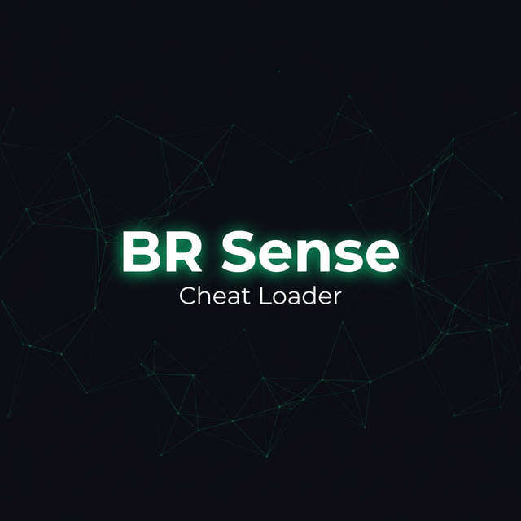

<p align="center">
  
</p>

<p align="center">
  
  
  
  
  
</p>

<p align="center">
  <strong>Desktop game loader com autenticação, licenciamento e painel administrativo.</strong><br/>
  <sub>C++ nativo · Win32 API · Custom dark UI · JWT auth · Admin panel</sub>
</p>

---

## ✨ Features

<table>
<tr>
<td width="50%">

**CLIENT**
- 🎨 UI premium com Dear ImGui + D3D11
- 🔐 Autenticação JWT + sessão persistente
- 🎮 Sistema de licenças por jogo
- 📋 Activity log em tempo real
- 🌐 Suporte EN/PT-BR
- 🛡️ Anti-debug e ofuscação de strings
- ⚡ Injeção com mapeamento de módulos

</td>
<td width="50%">

**SERVER**
- 🌍 API REST (Express.js)
- 👤 Gerenciamento de usuários + HWID
- 🎫 Sistema de licenças (temporal/lifetime)
- 📊 Painel administrativo web
- 🔒 Rate limiting + helmet + bcrypt
- 📝 Audit logging
- 📦 Download seguro de payloads (SHA256)

</td>
</tr>
</table>

---

## 📂 Estrutura

```
├── src/
│   ├── core/               # Lógica principal
│   │   ├── main.cpp         # Entrypoint (D3D11 + ImGui init)
│   │   ├── app.cpp/h        # State machine da aplicação
│   │   ├── database.cpp/h   # Cliente HTTP (WinHTTP)
│   │   ├── injector.cpp/h   # Injeção de módulos
│   │   ├── session.cpp/h    # Sessão local (DPAPI)
│   │   ├── config.cpp/h     # Configuração do loader
│   │   ├── hwid.cpp/h       # Hardware ID
│   │   └── strings.h        # i18n (EN/PT-BR)
│   │
│   ├── design/             # Interface gráfica
│   │   ├── design_system.h  # Tokens de cor, spacing, helpers
│   │   ├── fonts.cpp/h      # Sistema de fontes (Inter + Mono)
│   │   ├── theme.cpp/h      # Tema ImGui customizado
│   │   ├── connecting_screen.cpp
│   │   ├── login_screen.cpp
│   │   ├── loader_screen.cpp
│   │   ├── ui_controls.cpp  # Window controls + flags
│   │   └── texture_loader.cpp
│   │
│   └── security/           # Proteções
│       ├── anti_debug.cpp/h
│       ├── peb_stealth.h
│       └── xorstr.hpp
│
├── server/
│   ├── index.js             # Bootstrap do Express
│   ├── src/
│   │   ├── config.js
│   │   ├── database.js
│   │   ├── middleware.js
│   │   ├── schema.js
│   │   ├── admin-panel.html
│   │   ├── routes/          # Rotas da API
│   │   ├── controllers/     # Lógica de negócio
│   │   └── services/        # Serviços compartilhados
│   └── payloads/            # DLLs (gitignored)
│
├── vendor/imgui/            # Dear ImGui + backends
└── IMGUI_CS.sln             # Visual Studio solution
```

---

## 🚀 Setup

### Pré-requisitos

| Componente | Versão |
|------------|--------|
| Visual Studio | 2022 (v145 toolset) |
| Windows SDK | 10.0+ |
| Node.js | 18+ |
| MariaDB/MySQL | 10.6+ |

### Server

```bash
# 1. Configure o banco
mysql -u root < server/setup.sql

# 2. Configure variáveis de ambiente
cp server/.env.example server/.env
# Edite server/.env com suas credenciais

# 3. Instale e inicie
cd server
npm install
npm start
```

O servidor inicia em `http://localhost:3000`:
- **API:** `/api/auth/login`, `/api/download/:id`, etc.
- **Admin:** `http://localhost:3000/admin`

### Client

```bash
# 1. Abra a solution no Visual Studio
start IMGUI_CS.sln

# 2. Compile (Ctrl+Shift+B) — Debug ou Release x64

# 3. Copie as fontes para o diretório de saída
xcopy /Y /I src\design\fonts bin\Debug\fonts\
```

> **Nota:** O executável busca fontes TTF em `fonts/` ao lado do `.exe`. Se não encontrar, usa Segoe UI/Consolas como fallback.

---

## 🎨 Design System

O UI utiliza um design system centralizado em `design_system.h`:

| Token | Valor | Uso |
|-------|-------|-----|
| `DS::ACCENT` | `#00cc6a` | Cor principal (emerald) |
| `DS::BG_BASE` | `#0e0e18` | Fundo padrão |
| `DS::BG_CARD` | `#161624` | Cards e painéis |
| `DS::TEXT_PRIMARY` | `#f0f0f8` | Texto principal |
| `DS::ROUND_LG` | `12px` | Arredondamento padrão |

### Fontes

| Fonte | Uso |
|-------|-----|
| Inter Regular | Corpo de texto (16px) |
| Inter SemiBold | Subtítulos (18px) |
| Inter Bold | Títulos (22px, 28px, 32px) |
| JetBrains Mono | Terminal/logs (13px) |

---

## 🔒 Segurança

| Camada | Implementação |
|--------|---------------|
| Auth | JWT com expiração configurável |
| Senhas | bcrypt (rounds configuráveis) |
| Sessão | DPAPI para persistência local |
| Strings | XOR compile-time encryption |
| Anti-debug | IsDebuggerPresent + PEB checks + loop ativo |
| Admin | Admin key + rate limiting |
| Downloads | SHA256 hash verification |

---

## 📝 Variáveis de Ambiente

```env
PORT=3000
DB_HOST=localhost
DB_USER=root
DB_PASS=
DB_NAME=loader_db
DB_PORT=3306
JWT_SECRET=your-secret-key
JWT_EXPIRES=4h
ADMIN_KEY=your-admin-key
BCRYPT_ROUNDS=12
```

---

## 📄 Licença

Este projeto é privado e de uso pessoal. Não distribuir.

---

<p align="center">
  <sub>Built with C++, DirectX 11, Dear ImGui, Node.js & MariaDB</sub>
</p>
